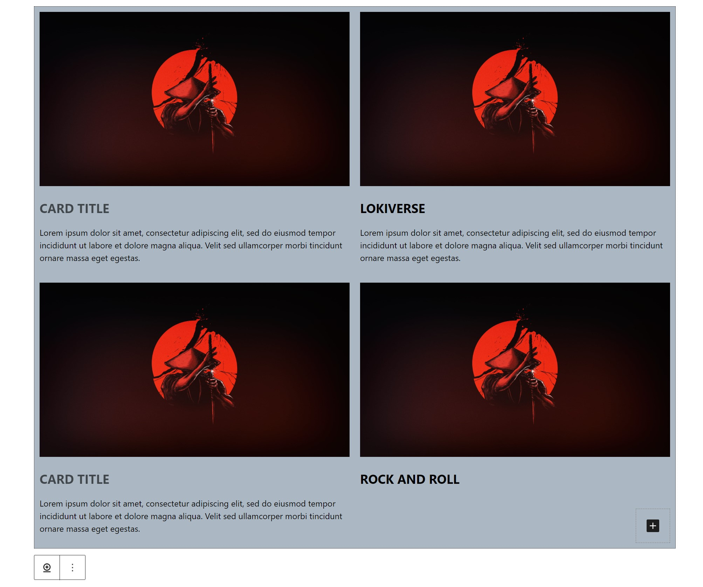
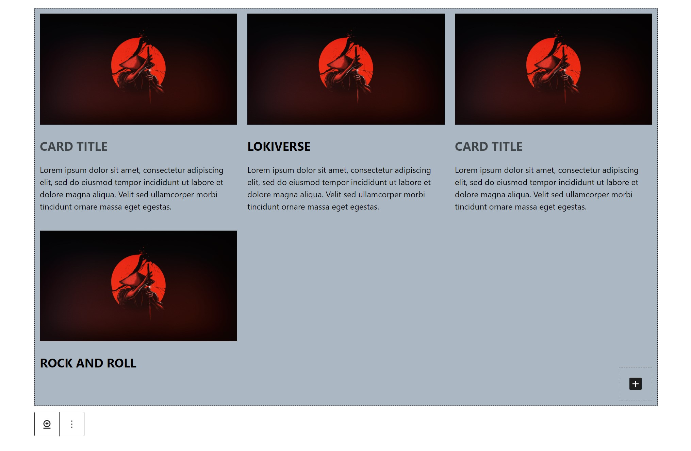
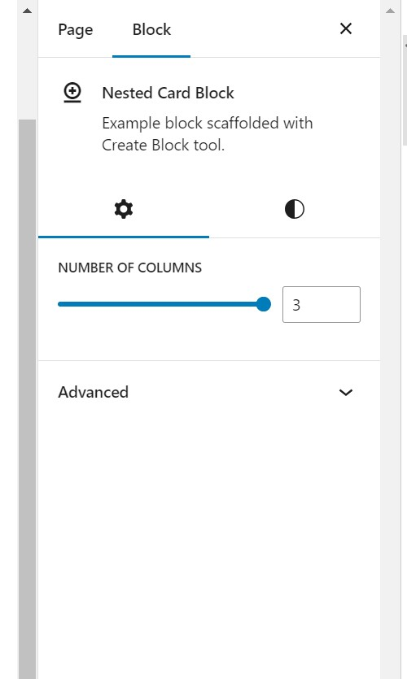
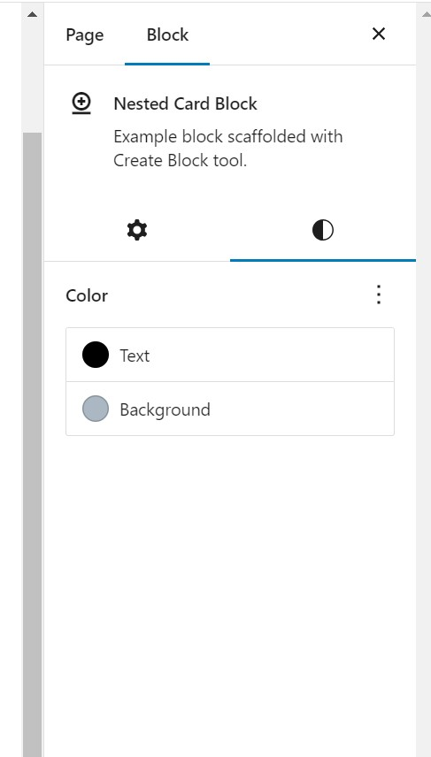

# NestedCardBlock
A gutenberg complex nested block for wordpress gutenberg block editor. This plugin allow user to register create a block with nested block. Parent block will allow user to manipulate number of grid columns. Parent block will only host registed "card-item" block which contains image and texts. User will be able to add as many "card-item" as they want. Parent block will render all the card items based on the specified columns. Children block has option to manipulate alignment of the text in the toolbar. 

## Project Display


\
\

\
\

\
\



## Built With

- VsCode
- React
- Wordpress block editor and components

# Getting Started

To get a local copy of the repository please run the following commands on your terminal:

```bash

$ git clone to plugin folders in wordpress site `https://github.com/ajkacca457/NestedCardBlock.git`
$ cd NestedCardBlock
$ Run `npm install` to install the necessary modules.
$ Run `npm run start` to start client server.

```

# Future development pipeline

- adding display order option for images and texts.
- adding transition animation dynamically.
- adding border manipuration for the card item.
- adding custom background and font selection.


# Authors

👤 **Avijit Karmaker**

- Github: [@Avijit](https://github.com/ajkacca457)
- Linkedin: [@Avijit](https://www.linkedin.com/in/avijit-karmaker-8738a54)

## 🤝 Contributing

Contributions, issues and feature requests are welcome!

## Show your support

Give a ⭐️ if you like this project!

## Copyright

This is a project developed by Avijit.
